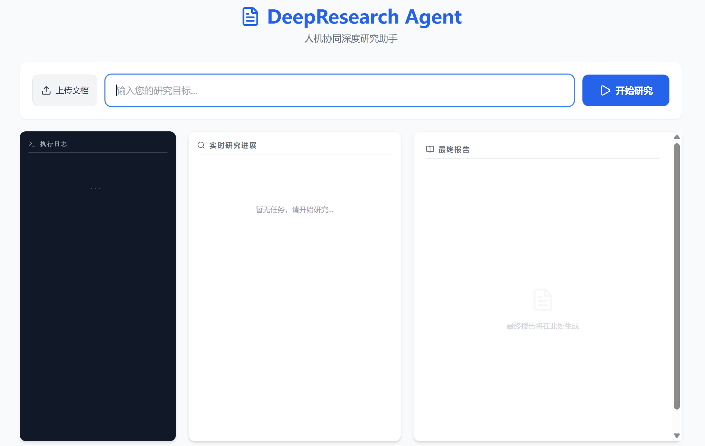
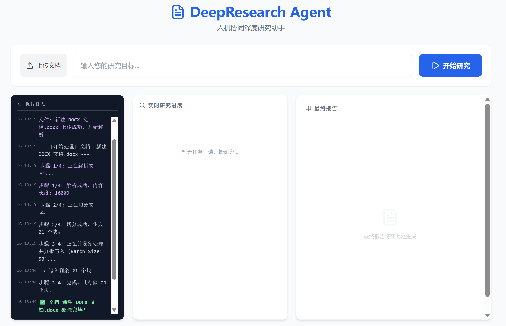
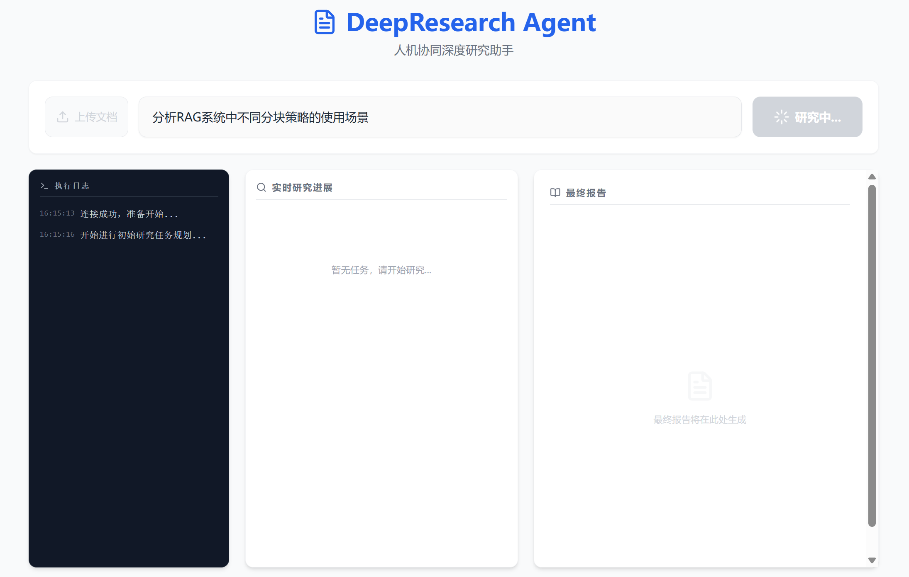
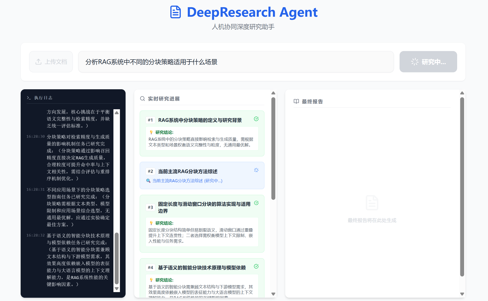
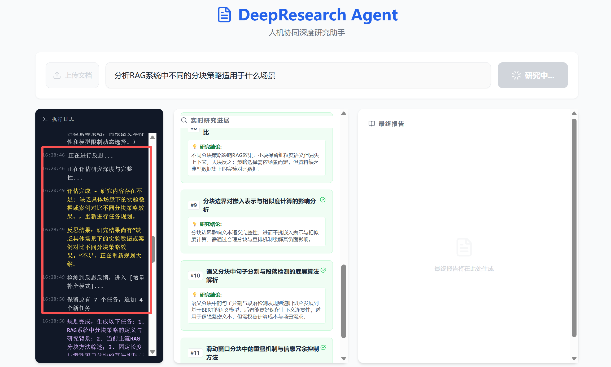
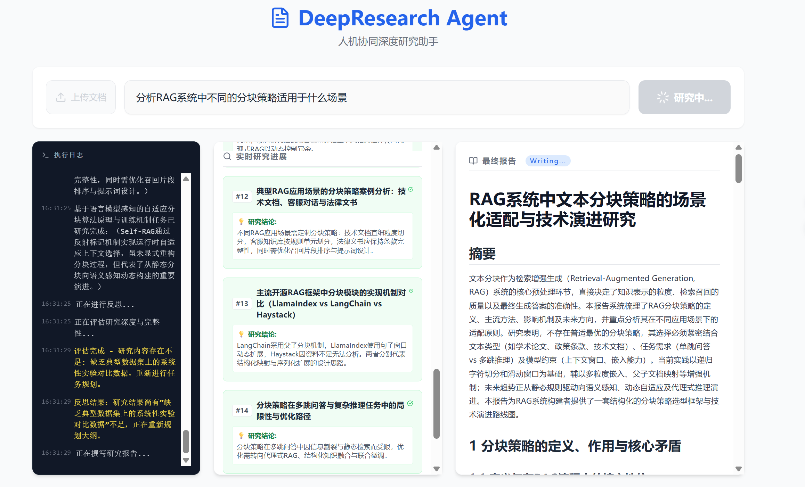

# DeepResearch-Agent 🚀

[](https://python.org)
[](https://fastapi.tiangolo.com)
[](https://reactjs.org)
[](https://langchain-ai.github.io/langgraph)
[](https://opensearch.org)
[](LICENSE)

## 📖 项目简介

DeepResearch-Agent 是一个基于 **多智能体协作** 的 **AI深度研究系统**，采用Clean Architecture架构设计，集成了文档解析、RAG（检索增强生成）、多模型LLM支持等企业级功能。

该系统能够：
- **智能解析**各类复杂文档（PDF、Word等）
- **自动化**生成研究计划和深度分析
- **实时交互式**的智能体协作流程
- **可视化**的进度追踪和结果展示
- **企业级**的可观测性和追踪能力

<div align="center">
  
  <br>
  <i>图 1：DeepResearch Agent 初始运行界面</i>
</div>
---

## ✨ 核心特性

### 🎯 多智能体协作系统
- **协调器（Orchestrator）**: 全局流程控制与任务调度
- **规划器（Planner）**: 智能生成研究任务大纲
- **执行器（Worker）**: 深度研究与内容生成
- **反思器（Reflector）**: 质量评估与结果优化

### 📚 智能文档解析
- **Docling引擎**: 支持复杂文档结构解析（表格、公式、图片）
- **VLM增强**: 视觉语言模型增强文档理解
- **多模态处理**: 自动识别公式、图表、表格等复杂元素
- **智能分块**: 基于语义和结构的文档切片优化

### 🔍 高级检索系统
- **OpenSearch**: 高性能混合检索引擎
- **多模型支持**: 支持多种嵌入模型和重排序模型
- **语义检索**: 结合向量化与关键词的混合检索
- **BGE Reranker**: GPU加速的文档重排序

### 💬 实时交互
- **SSE流式传输**: 实时展示研究进度
- **人机协作**: 支持人工审核和反馈迭代
- **进度可视化**: 直观展示各阶段执行状态
- **Markdown渲染**: 支持LaTeX数学公式的富文本展示

### 🔧 可观测性
- **Langfuse集成**: 全链路追踪和性能监控
- **结构化日志**: 分级日志记录系统
- **指标追踪**: 智能体性能与成本分析

---

## 🏗️ 架构设计

### 技术栈

#### 后端
- **FastAPI**: 高性能异步Web框架
- **LangGraph**: 智能体编排框架
- **Docling**: 文档解析引擎
- **OpenSearch**: 搜索引擎与向量存储
- **LiteLLM**: 多模型统一代理
- **Pydantic**: 数据验证与序列化

#### 前端
- **React 19**: 现代化前端框架
- **Vite**: 极速构建工具
- **Tailwind CSS**: 原子化CSS框架
- **React-Markdown**: Markdown渲染
- **KaTeX**: 数学公式渲染

#### 基础设施
- **Docker Compose**: 容器化编排
- **Python 3.13+**: 现代Python特性
- **UV**: 高性能包管理器

### 系统架构图

```
┌──────────────────────────────────────────────────────────────┐
│                        Frontend (React)                      │
│  ┌──────────────┐  ┌──────────────┐  ┌──────────────┐        │
│  │ 研究任务启动  │  │  实时进度展示 │  │  结果查看     │        │
│  └──────┬───────┘  └──────┬───────┘  └──────┬───────┘        │
└─────────┼──────────────────┼──────────────────┼──────────────┘
          │                  │                  │
          ▼                  ▼                  ▼
┌───────────────────────────────────────────────────────────────┐
│                      Backend API (FastAPI)                    │
│  ┌──────────────┐  ┌──────────────┐  ┌──────────────┐         │
│  │/api/research/│  │/api/ingest/  │  │/api/document/│         |
│  └──────┬───────┘  └──────┬───────┘  └──────┬───────┘         │
└─────────┼──────────────────┼──────────────────┼───────────────┘
          │                  │                  │
          ▼                  ▼                  ▼
┌─────────────────────────────────────────────────────────────┐
│                Multi-Agent Layer (LangGraph)                │
│  ┌──────────┐  ┌──────────┐  ┌──────────┐  ┌──────────┐     │
│  │协调器     │  │ 规划器   │  │ 执行器    │  │ 反思器   │     │
│  └─────┬────┘  └─────┬────┘  └─────┬────┘  └─────┬────┘     │
│        │            │            │            │             │
│        └────────────┴────────────┴────────────┘             │
└─────────────────────┬───────────────────────────────────────┘
                      │
                      ▼
┌─────────────────────────────────────────────────────────────┐
│                    Infrastructure Layer                     │
│  ┌──────────────┐  ┌──────────────┐  ┌──────────────┐       │
│  │ OpenSearch   │  │  TEI Reranker│  │  Documents   │       │
│  │ (Search + KV)│  │ (GPU Cache)  │  │  Storage     │       │
│  └──────────────┘  └──────────────┘  └──────────────┘       │
└─────────────────────────────────────────────────────────────┘
```

---

## 🚀 快速开始

### 环境要求

在开始之前，请确保您的系统已安装以下依赖：

- **Python**: 3.13+
- **Node.js**: 18+
- **Docker**: 20.10+
- **UV**: 高性能Python包管理器
- **Ollama**: 本地大模型推理引擎（用于embedding模型）
- **GPU**: 可选（推荐RTX 4060及以上，用于TEI重排序器加速）

### 1. 克隆项目和安装依赖

```bash
git clone https://github.com/yjryjrhehe/deepresearch-agent.git
cd deepresearch-agent

# 首先安装 uv
# pip install uv
uv sync
```

### 2. 配置环境变量

项目需要在项目根目录配置 `.env` 文件。先复制并重命名`.env.example` 模板文件：

```bash
cp .env.example .env
```

然后编辑 `.env` 文件，填入您的API密钥：

```env
# 智谱GLM API Key
GLM_API_KEY="your_glm_api_key"

# 阿里通义千问API Key
QWEN_API_KEY="your_qwen_api_key"
```

**注意**：请将示例API密钥替换为您自己申请的真实密钥。

**API密钥获取方式：**

- **智谱GLM API Key**: 访问 [智谱AI开放平台](https://open.bigmodel.cn/) 注册并获取API密钥
- **阿里通义千问API Key**: 访问 [DashScope控制台](https://dashscope.console.aliyun.com/) 注册并获取API密钥

### 3. 配置Ollama并拉取Embedding模型

项目使用Ollama作为Embedding模型的本地推理引擎。首先安装Ollama并拉取指定模型：

**安装Ollama:**

```bash
# Windows
# 从 https://ollama.ai 下载并安装

# macOS/Linux
curl -fsSL https://ollama.ai/install.sh | sh
```

**拉取Embedding模型:**

```bash
ollama pull qwen3-embedding:4b
```

该模型用于将文档和查询转换为向量表示，是RAG系统的核心组件。如果您的硬件资源有限，可以选择更小的模型，但需要在配置文件中修改相应设置。

### 4. 运行项目启动脚本

项目提供了统一的启动脚本 `run.py`，该脚本会自动：

- 检查并下载TEI重排序器模型文件（使用ModelScope）
- 检查并安装前端依赖（npm install）
- 启动LiteLLM代理服务（端口4000）
- 启动FastAPI后端服务（端口8002）
- 启动React前端应用（端口5173）

```bash
# 运行启动脚本
python run.py
```

**启动脚本功能说明：**

1. **预检阶段**: 检查并下载BGE重排序器模型到`models/BAAI/bge-reranker-base`目录，安装前端依赖
2. **LiteLLM代理**: 启动统一模型代理服务，端口4000
3. **FastAPI后端**: 启动API后端服务，端口8002
4. **React前端**: 启动开发服务器，端口5173

### 5. 启动基础设施服务

在新的终端窗口中，启动OpenSearch和TEI服务：

```bash
# 启动必要的基础设施服务（OpenSearch、OpenSearch Dashboards、TEI Reranker）
docker-compose up -d
```

**服务说明：**
- **OpenSearch**: 搜索引擎与向量存储（端口9200）
- **OpenSearch Dashboards**: OpenSearch可视化界面（端口5601）
- **TEI Reranker**: 基于GPU的文档重排序服务（端口8082）

### 6. （可选）启动Langfuse追踪服务

如果需要使用Langfuse进行提示词管理、模型输入输出追踪和评估，启动可选的Langfuse服务：

项目需要在项目根目录配置 `.env` 文件。先复制并重命名`.env.example` 模板文件：

```bash
cd langfuse
cp .env.example .env
```

然后编辑 `.env` 文件，进行以下设置：

```env
# --- 1. 数据库密码 ---
# 设置 PostgreSQL 密码
POSTGRES_PASSWORD=xxx

# 设置 ClickHouse 密码
CLICKHOUSE_PASSWORD=xxx

# 设置 Minio 密码
MINIO_ROOT_PASSWORD=xxx

# 设置 Redis 密码
REDIS_AUTH=xxx

# --- 2. Langfuse 核心安全密钥 ---
# 必须是一个 64 位的十六进制字符串 (32 字节)。
# 在 Linux/macOS 上运行: openssl rand -hex 32
# 在 Windows 上运行：python -c "import secrets; print(secrets.token_hex(32))"
ENCRYPTION_KEY=90e2abbf1940d5c028627e86398883703437be3a4fd1xxxxxx

# 用于会话签名的随机字符串
NEXTAUTH_SECRET=4f65e01508625195fbdacb56bbcb6337fc3b0ac238d52xxxxx

# 用于内部哈希的随机字符串
SALT=ea92f2469f59310851d1b9fb30c33915c5c30ab3d0xxxxx
```

**注意**：相关密码设置需要包含数字、大小写子母和字符。

```bash
docker-compose up -d
```

**Langfuse服务说明：**
- **langfuse-web**: Web界面（端口3000）
- **postgres**: 数据库（端口6432）
- **redis**: 缓存（端口6379）
- **clickhouse**: 分析数据库（端口7125）
- **minio**: 对象存储（端口9090）

如果不使用Langfuse，系统将使用代码中写死的提示词模板。

### 7. 访问应用

当所有服务启动完成后，访问以下地址：

- **前端应用**: http://localhost:5173
- **API文档**: http://localhost:8002/docs
- **OpenSearch Dashboards**: http://localhost:5601
- **Langfuse Web** (可选): http://localhost:3000

### 完整启动顺序

1. `git clone` 项目
2. `uv sync` 配置环境
3. 配置 `.env` 环境变量信息（填入API密钥）
4. 安装 Ollama 并执行 `ollama pull qwen3-embedding:4b`
5. 运行 `python run.py`（包括下载TEI模型文件和启动前后端及LiteLLM服务）
6. 运行 `docker-compose up -d`（项目根目录）
7. 运行 `langfuse/docker-compose up -d`（可选）

---

## 📋 配置说明

### LiteLLM模型配置

在 `config.yaml` 中配置你的LLM模型。本项目支持的模型包括云端模型和本地模型：

```yaml
model_list:
  # 智谱GLM云端模型
  - model_name: "glm-4-flashx"
    litellm_params:
      model: "openai/glm-4-flashx-250414"
      api_base: "https://open.bigmodel.cn/api/paas/v4/"
      api_key: "os.environ/GLM_API_KEY"

  - model_name: "glm-4v-plus"
    litellm_params:
      model: "openai/glm-4v-plus-0111"
      api_base: "https://open.bigmodel.cn/api/paas/v4/"
      api_key: "os.environ/GLM_API_KEY"

  # 阿里通义千问云端模型
  - model_name: "qwen3-max"
    litellm_params:
      model: "openai/qwen3-max"
      api_base: "https://dashscope.aliyuncs.com/compatible-mode/v1"
      api_key: "os.environ/QWEN_API_KEY"

  # 本地Ollama模型（用于对话）
  - model_name: "qwen3-4b-local"
    litellm_params:
      model: "ollama/qwen3:4b"
      api_base: "http://localhost:11434"

  # 本地Ollama模型（用于embedding）
  - model_name: "qwen3-embedding-4b-local"
    litellm_params:
      model: "ollama/qwen3-embedding:4b"
      api_base: "http://localhost:11434"
      drop_params: True

server_settings:
  port: 4000
  host: "0.0.0.0"
```

### 环境变量配置

在 `.env` 文件中配置关键参数。以下是完整的配置项：

```env
# ====================
# API密钥配置
# ====================
GLM_API_KEY="your_glm_api_key"          # 智谱AI API密钥
QWEN_API_KEY="your_qwen_api_key"        # 阿里云API密钥

# ====================
# 日志配置
# ====================
LOG_LEVEL="INFO"

# ====================
# LiteLLM代理配置
# ====================
LITELLM_PROXY_URL="http://127.0.0.1:4000"

# ====================
# Docling文档解析配置
# ====================
DOCLING_VLM_API_KEY="xx"
DOCLING_VLM_BASE_URL="http://127.0.0.1:4000"
DOCLING_VLM_MODEL="glm-4v-plus"
DOCLING_VLM_MAX_CONCURRENCY="5"

DOCLING_LLM_API_KEY="xx"
DOCLING_LLM_BASE_URL="http://127.0.0.1:4000"
DOCLING_LLM_MODEL="glm-4-flashx"
DOCLING_LLM_MAX_CONCURRENCY="30"

# ====================
# 文本分块配置
# ====================
MAX_CHUNK_TOKENS=1024
ENCODING_NAME="cl100k_base"
CHUNK_OVERLAP_TOKENS=100

# ====================
# 预处理LLM配置
# ====================
PREPROCESSING_LLM_API_KEY="xx"
PREPROCESSING_LLM_BASE_URL="http://127.0.0.1:4000"
PREPROCESSING_LLM_MODEL="glm-4-flashx"
PREPROCESSING_LLM_MAX_CONCURRENCY=30

# ====================
# Embedding模型配置
# ====================
EMBEDDING_LLM_API_KEY="xx"
EMBEDDING_LLM_BASE_URL="http://127.0.0.1:4000"
EMBEDDING_LLM_MODEL="qwen3-embedding-4b-local"  # 使用Ollama本地模型
EMBEDDING_LLM_DIMENSION=2560
EMBEDDING_LLM_MAX_CONCURRENCY=5

# ====================
# 查询重写LLM配置
# ====================
REWRITE_LLM_API_KEY="xx"
REWRITE_LLM_BASE_URL="http://127.0.0.1:4000"
REWRITE_LLM_MODEL="glm-4-flashx"
REWRITE_LLM_MAX_CONCURRENCY=30

# ====================
# 研究主模型配置
# ====================
RESEARCH_LLM_API_KEY="xx"
RESEARCH_LLM_BASE_URL="http://127.0.0.1:4000"
RESEARCH_LLM_MODEL="qwen3-max"  # 主要研究任务使用的模型
RESEARCH_LLM_MAX_CONCURRENCY=30

# ====================
# TEI重排序器配置
# ====================
TEI_RERANK_BASE_URL="http://localhost:8082"  # TEI服务地址
TEI_RERANK_API_KEY=None
TEI_RERANK_MAX_CONCURRENCY=50
TEI_RERANK_TIMEOUT=30.0

# ====================
# OpenSearch配置
# ====================
OPENSEARCH_INDEX_NAME="rag_system_chunks_async"
OPENSEARCH_HOST="localhost"
OPENSEARCH_PORT=9200
AUTH="admin:admin"
OPENSEARCH_USE_SSL=False
OPENSEARCH_VERIFY_CERTS=False
OPENSEARCH_BULK_CHUNK_SIZE=500

# ====================
# Langfuse追踪配置
# ====================
LANGFUSE_SECRET_KEY="sk-lf-xxx"  # 替换为你的密钥
LANGFUSE_PUBLIC_KEY="pk-lf-xxx"  # 替换为你的公钥
LANGFUSE_BASE_URL="http://localhost:3000"
```

### Embedding和Reranker模型配置说明

**Embedding模型（向量化引擎）:**

项目使用Ollama作为Embedding模型的本地推理引擎。默认配置使用 `qwen3-embedding:4b` 模型，该模型：
- 参数量：4B
- 向量维度：2560
- 优点：本地运行，隐私安全，成本低
- 推理地址：http://localhost:11434

如需更换其他embedding模型，请执行以下步骤：

1. **拉取新模型**（以nomic-embed-text为例）:
```bash
ollama pull nomic-embed-text
```

2. **修改`config.yaml`**:
```yaml
- model_name: "nomic-embedding-local"
  litellm_params:
    model: "ollama/nomic-embed-text"
    api_base: "http://localhost:11434"
    drop_params: True
```

3. **修改`.env`文件中的模型名称**:
```env
EMBEDDING_LLM_MODEL="nomic-embedding-local"
```

**硬件建议**: 4B模型建议至少4GB显存，推荐8GB以上。如果显存不足，可以选择1B参数的模型。

**Reranker模型（重排序引擎）:**

项目使用TEI（Text Embeddings Inference）作为Reranker模型的推理引擎，支持GPU加速。默认配置使用 `BAAI/bge-reranker-base` 模型，该模型：
- 基础模型：BGE Reranker Base
- 优势：基于GPU的高性能重排序
- 推理地址：http://localhost:8082
- 位置：models/BAAI/bge-reranker-base

如需更换其他reranker模型，请执行以下步骤：

1. **下载新模型**（例如bge-reranker-large）:
```bash
modelscope download --model BAAI/bge-reranker-large --local_dir models
```

2. **修改`docker-compose.yml`中的模型路径**:
```yaml
tei-reranker:
  command: >
    --model-id /models/BAAI/bge-reranker-large
    --port 80
    --dtype float16
    --auto-truncate
```

3. **重启TEI服务**:
```bash
docker-compose up -d tei-reranker
```

**硬件建议**: TEI需要NVIDIA GPU，建议RTX 4090（24GB显存）或RTX 3090（24GB显存）。显存至少需要8GB。

**注意**: 如果没有GPU，可以删除docker-compose.yml中的TEI服务相关配置，OpenSearch将使用向量相似度进行检索，但重排序效果会降低。

---

## 📖 使用指南

### 1. 文档上传与解析

访问前端应用 http://localhost:5173，点击"上传文档"按钮，选择需要研究的PDF或Word文档。

<div align="center">
  
  <br>
  <i>图 2：上传文档与解析</i>
</div>

**上传流程说明：**

当文档上传后，系统会自动进行以下处理：

1. **文档解析阶段**
   - 识别文档类型和结构
   - 提取文本内容
   - 识别表格、公式、图片等复杂元素

2. **预处理阶段**
   - 清洗文本内容，去除噪声
   - 识别文档层次结构
   - 标记特殊元素（表格、公式位置）

3. **VLM增强阶段**（可选）
   - 使用视觉语言模型识别图片中的文字和图表
   - 对复杂表格进行结构化处理
   - 提取并转换数学公式

4. **智能分块阶段**
   - 基于语义和结构将文档切分成合适大小的文本块
   - 每个文本块约1024个token
   - 保持块与块之间的上下文关联

5. **向量化与索引阶段**
   - 使用embedding模型将文本块转换为向量
   - 向量维度：2560
   - 将向量和元数据存储到OpenSearch

**预期耗时：** 文档解析时间取决于文档大小和复杂度。（实测，对于文本型pdf，七十页的硕士论文处理时间在3-8分钟，实际时间与图片数量有关。）

### 2. 创建研究任务

<div align="center">
  
  <br>
  <i>图 3：创建研究任务</i>
</div>

在主界面的输入框中输入您的研究目标或问题。有效的输入应该：

- **明确具体**：例如"分析Transformer架构在大规模语言模型中的应用"而不是"AI相关"
- **包含上下文**：说明您希望从哪些角度进行分析
- **限定范围**：可以指定时间范围、行业领域等

**示例输入：**
- "分析2024年生成式AI在金融行业的应用现状、主要挑战和未来趋势"
- "研究量子计算在优化问题中的优势、当前技术瓶颈及商业化前景"
- "对比分析GPT、BERT、T5等预训练模型在文本摘要任务上的性能差异"

### 3. 智能体协作流程

系统会启动多智能体协作流程，包括四个智能体的有序协作：

#### 阶段1：规划（Orchestrator + Planner）
协调器首先分析用户输入，生成研究计划，然后由规划器智能体详细展开研究大纲。

<div align="center">
  
  <br>
  <i>图 4：智能体生成研究大纲</i>
</div>

**流程：**
1. 协调器接收研究任务，分解为子问题
2. 规划器基于文档库和子问题生成详细的研究大纲
3. 研究大纲包括：
   - 主要研究方向和子主题
   - 每个方向的预期产出
   - 研究深度和广度建议
4. 大纲展示给用户，等待审核

**用户交互：**
- 可以选择"同意"开始执行
- 可以选择"修改"并提供反馈，规划器将基于反馈调整大纲

#### 阶段2：执行（Worker）
执行器智能体根据审核通过的研究大纲，对每个子主题进行深度研究。

<div align="center">
  
  <br>
  <i>图 5：智能体研究过程</i>
</div>

**执行流程：**
1. 针对每个研究方向，执行器会：
   - 查询相关文档内容（混合检索：关键词+向量+重排序）
   - 分析文档片段
   - 提取关键信息和证据
   - 生成初步分析结果

2. 研究过程中的实时反馈：
   - SSE流式输出当前进度和发现
   - 显示正在分析的具体文档
   - 实时展示生成的段落内容

3. 检索优化：
   - 首先基于关键词进行初步检索
   - 使用embedding模型进行语义匹配
   - 使用TEI重排序器对候选文档进行精排
   - 提取Top-K相关内容进行分析

**预期耗时：** 每个研究方向需要1-5分钟，取决于文档库大小和研究深度。

#### 阶段3：反思（Reflector）
反思器智能体评估研究结果的质量和完整性。

<div align="center">
  
  <br>
  <i>图 6：智能体反思阶段</i>
</div>

**评估维度：**
1. **内容完整性**：是否覆盖了研究大纲的所有要点
2. **证据充分性**：是否提供了足够的文档证据支持结论
3. **逻辑一致性**：论证过程是否逻辑清晰、无矛盾
4. **深度分析**：是否进行了深度分析而非浅层描述

**优化策略：**
- 如果发现内容不足，反思器会标记不足的领域
- 触发执行器对标记领域进行补充研究
- 最多可迭代3轮优化

#### 阶段4：报告生成（Reporter）
报告生成器将所有研究结果汇总成结构化的研究报告。

<div align="center">
  
  <br>
  <i>图 7：报告生成阶段</i>
</div>

**报告结构：**
- 执行摘要：核心发现和结论
- 研究背景：问题定义和研究范围
- 详细分析：每个子主题的深度研究结果
- 数据支撑：引用文档中的关键证据
- 总结与建议：总体结论和未来方向
- 参考文献：引用文档清单

### 4. 实时进度监控

系统提供全方位的进度追踪和状态可视化：

**前端可视化组件：**
- 📊 **进度条**：显示当前阶段和整体进度百分比
- 📝 **实时日志**：滚动显示详细的执行日志
- 🔍 **当前状态**：展示正在执行的智能体和具体操作
- 📄 **文档追踪**：显示正在分析的文档名称
- 💬 **流式输出**：实时显示生成的文本内容

**状态指示器：**
- 🟢 绿色：正常执行
- 🟡 黄色：等待用户输入或优化中
- 🔴 红色：遇到错误或异常
- ⚪ 灰色：等待中

**交互控制：**
- 支持随时查看历史进度
- 支持中断当前研究（Ctrl+C）
- 支持恢复中断的研究任务

### 5. 查看研究结果

**前端结果展示：**
1. **主报告视图**
   - Markdown格式渲染，支持LaTeX数学公式
2. **引用文档导航**
   - 点击文档引用可直接跳转到相关段落
   - 查看文档来源和上下文
   - 支持多文档交叉引用
3. **性能指标**
   - 文档处理数量
   - 检索相关性评分
   - 智能体执行时间统计

---

## 🔍 Langfuse 提示词管理与追踪

Langfuse是一个开源的LLM应用可观测性平台，本项目集成了Langfuse用于提示词管理、模型输入输出追踪和效果评估。

### Langfuse 功能说明

**1. 提示词管理**
- 集中管理所有智能体的提示词模板
- 版本控制：记录提示词的每次修改历史
- A/B测试：对比不同提示词版本的效果
- 动态更新：无需重启服务即可更新提示词

**2. 模型追踪**

- 记录每个LLM调用的输入和输出
- 追踪token消耗和延迟
- 监控模型性能和成本
- 识别异常调用和错误

**3. 效果评估**
- 人工评估：对研究结果进行评分和反馈
- 自动评估：基于预定义指标自动评分
- 对比分析：不同模型、不同提示词的效果对比
- 趋势分析：长期性能变化趋势

### 使用 Langfuse

见 [Langfuse Documentation - Langfuse](https://langfuse.com/docs)。

------

## 🛠️ 项目结构

```
deepresearch-agent/
├── src/
│   ├── backend/
│   │   ├── api/                    # API层
│   │   │   ├── server.py          # FastAPI入口
│   │   │   └── schemas.py         # 数据模型
│   │   ├── core/                  # 核心层
│   │   │   ├── config.py          # 配置管理
│   │   │   └── logging.py         # 日志配置
│   │   ├── domain/                # 领域层
│   │   │   ├── models.py          # 业务模型
│   │   │   └── interfaces.py      # 接口定义
│   │   ├── infrastructure/        # 基础设施层
│   │   │   ├── agents/            # 多智能体系统
│   │   │   ├── parse/             # 文档解析
│   │   │   ├── repository/        # 数据存储和检索
│   │   │   ├── llm/               # LLM集成
│   │   │   └── langfuse/          # 监控追踪
│   │   └── services/              # 服务层
│   │       ├── agent_service.py   # 深度研究智能体服务
│   │       ├── ingestion_service.py # 数据摄入和解析服务
│   │       └── factory.py
│   └── frontend/
│       ├── src/
│       │   ├── main.jsx           # 应用入口
│       │   ├── App.jsx            # 主组件
│       │   ├── index.css          # 全局样式
│       │   └── App.css            # 组件样式
│       ├── package.json
│       └── vite.config.js
├── models/                        # TEI模型文件
│   └── BAAI/bge-reranker-base
|—— langfuse/                      # langfuse部署文件
|	└── .env					 # 环境变量
|	└── docker-compose.yml         # 容器编排
├── uploads/                       # 上传文件
├── docker-compose.yml             # 容器编排
├── config.yaml                    # LiteLLM配置
├── pyproject.toml                 # Python依赖
├── .env                           # 环境变量
└── README.md                      # 项目文档
```

---

## 🤝 贡献指南

欢迎所有形式的贡献！

---

## 📈 路线图

### v1.1 (规划中)
- [ ] 支持更多文档格式 (Excel, PPT, Markdown)
- [ ] 集成Web搜索能力
- [ ] 多模态智能体（图像）

### v1.2 (规划中)
- [ ] 可视化研究流程编辑器
- [ ] 自定义智能体提示词UI
- [ ] 研究模板系统
- [ ] 批量研究任务

### v2.0 (展望)
- [ ] 实时协作编辑
- [ ] 知识图谱可视化
- [ ] 企业级SSO集成

---

## 📄 许可证

本项目基于MIT许可证开源 - 查看 [LICENSE](LICENSE) 文件了解详情

---

## 🙏 致谢

感谢以下开源项目：
- [LangGraph](https://langchain-ai.github.io/langgraph) - 智能体编排框架
- [Docling](https://github.com/DS4SD/docling) - 文档解析引擎
- [OpenSearch](https://opensearch.org) - 搜索引擎
- [FastAPI](https://fastapi.tiangolo.com) - Web框架
- [React](https://reactjs.org) - 前端框架

---

## 📞 联系方式

- **微信**：yjryjrhehe

---

<div align="center">
  <b>让AI为您的研究加速 🚀</b>
  <br>
  <i>如果这个项目对您有帮助，请给我一个 ⭐</i>
</div>
